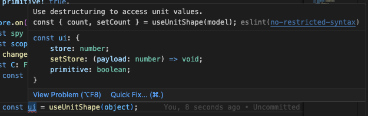

# effector-use-unit-shape

This library allows you to get store values in react component from complex unit structures and creates subscriptions to changes only for the values that are used. To achieve this behaviour, proxies are used under the hood.

## Table of Contents

- [Install](#install)
- [Usage](#usage)
  - [Unused values don't trigger re-renders](#unused-values-dont-trigger-re-renders)
- [Usage rule](#usage-rule)
- [Live example](#live-example)

## Install

```bash
npm i --save effector-use-unit-shape
```

This requires effector, effector-react and react.

## Usage

```tsx
const someStore = useUnitShape($someStore);

const { someStore } = useUnitShape({ $someStore }); // $ prefix removed

const { someStore, someEvent } = useUnitShape({ $someStore, someEvent });

const { 
  someStore1, 
  nested: { someStore2 } 
} = useUnitShape({ $someStore1, nested: { $someStore2 } }) // nested objects
```

### Unused values don't trigger re-renders

In this example, there is a user model containing two states: name and description. There are also components for displaying name and description. Components use only the properties they display. The useUnitShape hook creates subscriptions only for the properties that are used, so UserName won't re-render when $description changes, and UserDescription won't re-render when $name changes. This works with nested objects of any depth.

```tsx
import * as React from 'react';
import './style.css';
import { createEvent, createStore } from 'effector';
import { useUnitShape } from 'effector-use-unit-shape';

const userModelFactory = () => {
  const $name = createStore('');
  const $descriprion = createStore('');

  const changeName = createEvent<string>();
  const chnageDescription = createEvent<string>();

  $name.on(changeName, (_, name) => name);
  $descriprion.on(chnageDescription, (_, desc) => desc);

  return {
    $name,
    $descriprion,

    changeName,
    chnageDescription,
  };
};

const userModel = userModelFactory();

// will not rerender if description change
const UserName: React.FC = () => {
  const { name, changeName } = useUnitShape(userModel);

  return (
    <input
      placeholder="name"
      value={name}
      onChange={(e) => changeName(e.target.value)}
    />
  );
};

// will not rerender if name change
const UserDescription: React.FC = () => {
  const { descriprion, chnageDescription } = useUnitShape(userModel);

  return (
    <input
      placeholder="desciprtion"
      value={descriprion}
      onChange={(e) => chnageDescription(e.target.value)}
    />
  );
};

export default function App() {
  return (
    <div>
      <div>
        <UserName />
      </div>
      <div>
        <UserDescription />
      </div>
    </div>
  );
}
```

## Usage rule

Which properties are used is determined during object destructuring. Therefore, to ensure the hook works correctly, you should always use destructuring to obtain values. Otherwise, you may encounter conditional hooks.

```tsx
const { name, changeName } = useUnitShape(userModel); // good

const user = useUnitShape(userModel); // bad. subscriptions for user will not be created correctly.
return (
  <div>{user.name}</div>
)
```

To ensure proper usage of the hook, add an ESLint rule that will guarantee destructuring is used to access properties.

```json
  {
    "no-restricted-syntax": [
          "error",
          {
              "selector": "VariableDeclarator[init.callee.name=\"useUnitShape\"] > Identifier",
              "message": "Use destructuring to access unit values.\nconst { count, setCount } = useUnitShape(model);"
          },
      ]
  }
```



## Live example

https://stackblitz.com/edit/react-ts-cqqzfkjh?file=App.tsx